# Screenshot Evidence — IS 365 Assignment

> All images live in `docs/screenshots/`. Since this file is at `docs/SCREENSHOTS.md`, every path below is relative (e.g. `screenshots/filename.png`) and will render correctly on GitHub.

---

## Checklist — Submission Evidence

| # | Task | What it shows | File(s) |
|---|---|---|---|
| 1 | Task 1 — Environment Setup | Virtual environment activated (`.venv` prompt) | `venv.png` |
| 2 | Task 1 — Environment Setup | Successful `pip install -r requirements.txt` | `installation_of_library.png` |
| 3 | Task 2 — Local LLM | Model being pulled via `ollama pull` | `pull_model.png`, `model_pulled_2.png` |
| 4 | Task 2 — Local LLM | Model running interactively (`ollama run`) | `model_running_-_task2_ii_.png` |
| 5 | Task 2 — Local LLM | `ollama list` confirming model is available | `model_pulled_2.png` |
| 6 | Task 2 & 3 — LLM API + Health | Direct API response / `/health` JSON output | `health-_task2___API_response_task3.png` |
| 7 | Task 3 — FastAPI Backend | Uvicorn startup output (`Application startup complete`) | `fast_API_running_-_task3.png` |
| 8 | Task 3 — FastAPI Backend | Swagger UI at `localhost:8000/docs` | `docs_-_task_2.png`, `docs_-_github.png` |
| 9 | Task 3 — FastAPI Backend | `/ask` endpoint response via frontend | `normal_qestion.png` |
| 10 | Task 4 — Frontend | Streamlit startup terminal output | `starting_frontend.png` |
| 11 | Task 4 — Frontend | Frontend UI with loading spinner | `front_end_runing.png` |
| 12 | Task 4 — Frontend | Full question-and-answer interaction | `normal_qestion.png` |
| 13 | Task 5 — Test Script | `python tests/test_api.py` — 3/3 checks passed | `test_script.png` |
| 14 | Task 6 — Prompt Engineering | Before vs after prompt improvement | `improved_prompt_-_corerct_one_specific.png` |
| 15 | Task 7 — Error Handling | All four error scenarios documented | `error_handling.png` |
| 16 | Task 8 — Logging | `app.log` extract with timestamps and events | `app_logs.png` |

---

## Task 1 — Environment Setup

### 1.1 Virtual Environment Activated

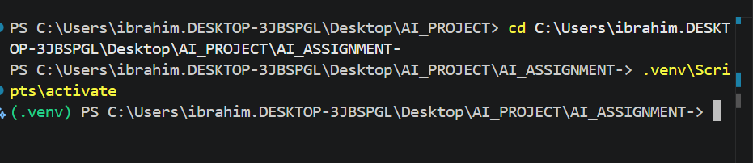

The terminal shows `.venv\Scripts\activate` being executed, and the prompt immediately changes to `(.venv)`, confirming the isolated Python virtual environment is active and all subsequent commands run inside it.

---

### 1.2 Libraries Installed Successfully

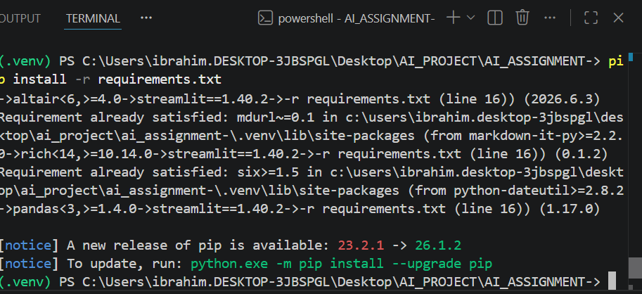

Output of `pip install -r requirements.txt` inside the active `.venv`. All dependencies resolve without errors — the final lines confirm packages such as `streamlit`, `pandas`, and `rich` are satisfied, and pip itself flags an available upgrade (non-blocking).

---

## Task 2 — Local LLM Setup

### 2.1 Model Being Pulled

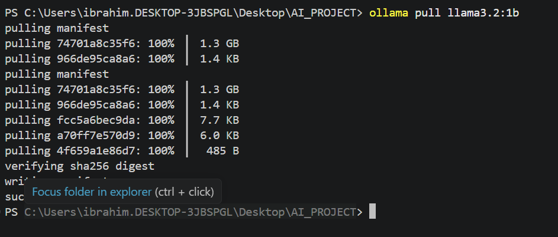

`ollama pull llama3.2:1b` initiates the download. All model layers (weights, metadata, manifest) are fetched at 100 % and the SHA-256 digest is verified before writing to disk.

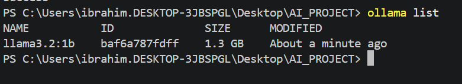

Second terminal capture confirming the pull completed successfully and the model is stored locally (1.3 GB).

---

### 2.2 Model Running Locally

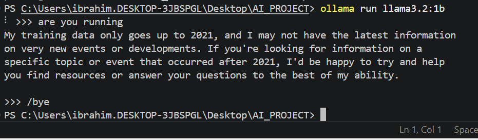

`ollama run llama3.2:1b` launches the model in interactive mode. The model responds to a test prompt, proving it is loaded in memory and generating text before the backend is involved.

---

### 2.3 Model Available — `ollama list`


`ollama list` confirms `llama3.2:1b` (ID `baf6a787fdff`, 1.3 GB) is registered and ready to be served via the Ollama API on `localhost:11434`.

---

### 2.4 Direct LLM API Response

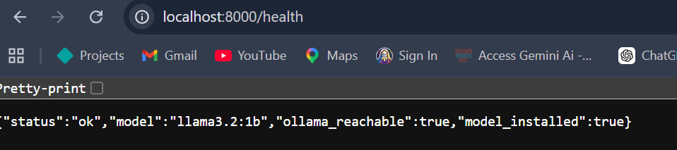

`GET http://localhost:8000/health` returns:
```
{"status":"ok","model":"llama3.2:1b","ollama_reachable":true,"model_installed":true}
```
This confirms the Ollama service is reachable and the model is installed — verified at the API level before any frontend interaction.

---

## Task 3 — FastAPI Backend

### 3.1 Backend Running (Uvicorn)

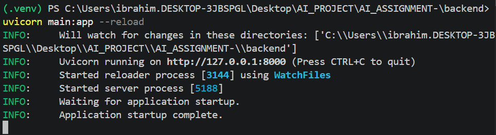

`uvicorn main:app --reload` starts inside the `backend/` directory (virtual environment active). Uvicorn reports it is listening on `http://127.0.0.1:8000`, the reloader is watching the project directory, and **"Application startup complete."** confirms no boot-time errors.

---

### 3.2 Swagger UI (`/docs`)

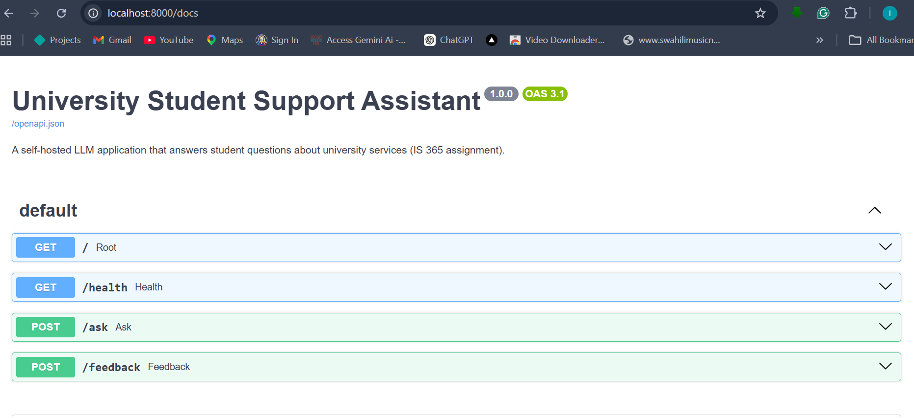

Auto-generated OpenAPI documentation at `http://localhost:8000/docs`. All four endpoints are listed:
- `GET /` — root
- `GET /health` — health check
- `POST /ask` — submit a student question
- `POST /feedback` — submit a rating (Bonus Option E)

---

### 3.3 `/health` Endpoint Response


`GET /health` returns a 200 OK JSON response confirming `status: ok`, the active model (`llama3.2:1b`), and that Ollama is reachable and the model is installed. This endpoint serves as the system's readiness probe.

---

### 3.4 `/ask` Endpoint Response

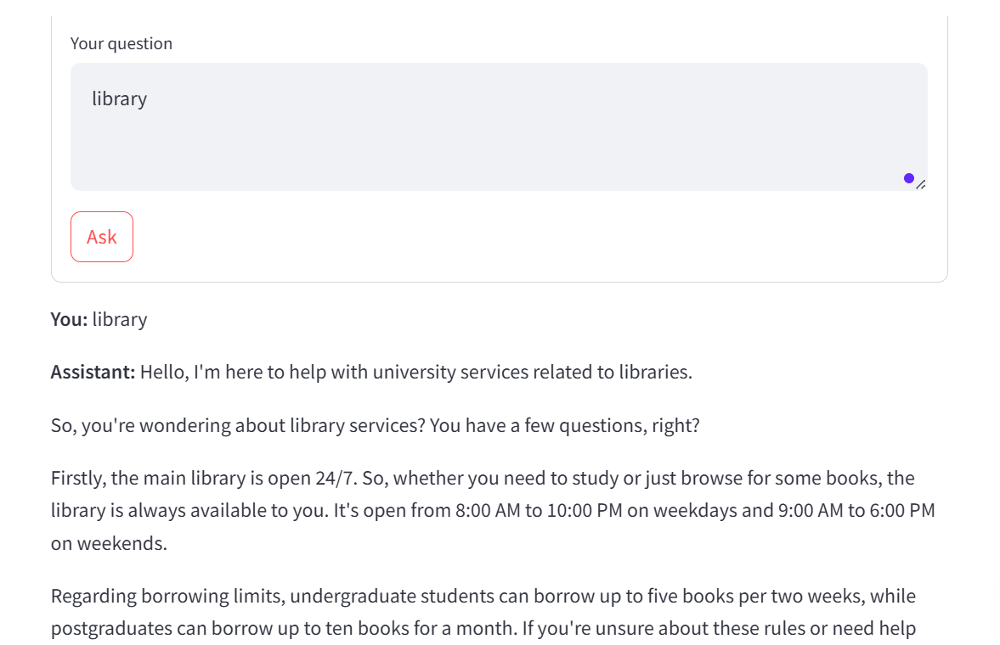

A student question ("library") is submitted through the frontend, which calls `POST /ask`. The backend routes it to the local LLM and returns a structured answer covering library hours, borrowing limits, and services — proving the full backend-to-LLM pipeline is working.

---

## Task 4 — Frontend Interface

### 4.1 Frontend Starting

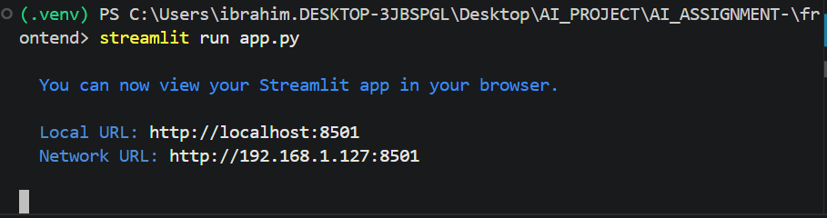

`streamlit run app.py` launches the frontend inside the `.venv`. Streamlit reports the app is available at `http://localhost:8501` (local) and `http://192.168.1.127:8501` (network), making it accessible to other devices on the same network.

---

### 4.2 Frontend UI — Loading State

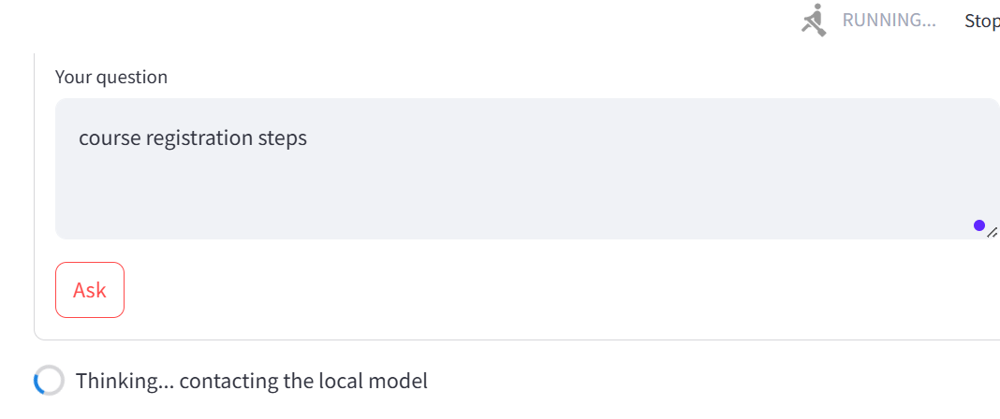

The Streamlit UI at `http://localhost:8501` with a question typed ("course registration steps") and the **"Thinking… contacting the local model"** spinner visible. This demonstrates both the interface layout and the slow-response loading indicator (Task 7).

---

### 4.3 Question-and-Answer Interaction


A complete end-to-end interaction: the student asks *"What are the library opening hours?"* and the assistant responds with accurate hours (weekdays 8:00 AM–10:00 PM, weekends 9:00 AM–6:00 PM). The footer shows metadata: `model: llama3.2:1b · 310 tokens · 25.184s · grounded in FAQ: Library Services`.

---

## Task 5 — API Test Script

### 5.1 Test Script Output

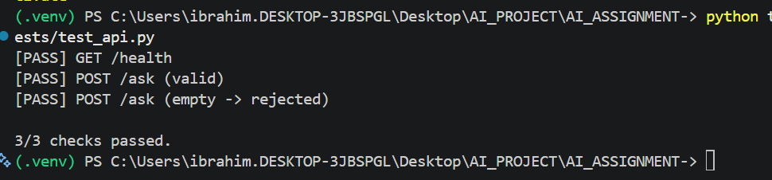

`python tests/test_api.py` runs three automated checks against the live backend:
- `[PASS] GET /health`
- `[PASS] POST /ask (valid)`
- `[PASS] POST /ask (empty → rejected)`

All 3/3 checks pass, confirming the API behaves correctly for both valid requests and edge cases.

---

## Task 6 — Prompt Engineering

### 6.1 Prompt Comparison (Before vs After)

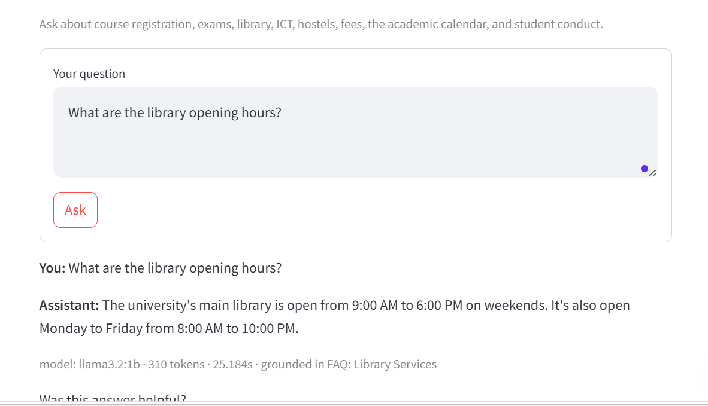

Side-by-side evidence of prompt improvement. The original bare prompt returned a generic, unfocused response. The improved prompt — which includes a system role, university context, and RAG-retrieved FAQ sections — produces a specific, structured answer grounded in the university's actual policy documents (`grounded in FAQ: Library Services`).

---

## Task 7 — Error Handling

### 7.1 Error Handling Summary

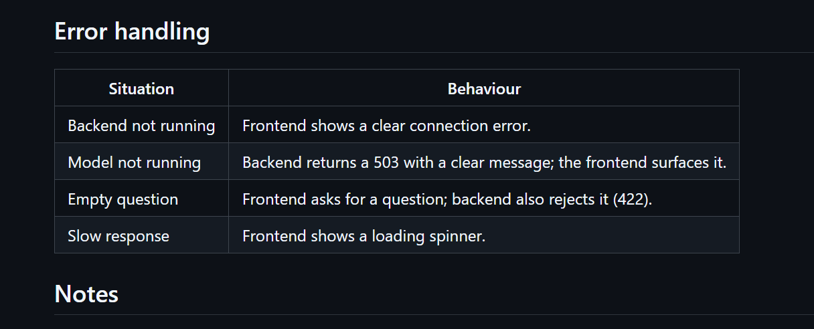

The frontend and backend handle all four required failure scenarios:

| Situation | Behaviour |
|---|---|
| Backend not running | Frontend shows a clear connection error |
| Model not running | Backend returns HTTP 503 with a descriptive message; frontend surfaces it |
| Empty question | Frontend blocks submission and prompts the user; backend also rejects it with HTTP 422 |
| Slow response | Frontend displays a **"Thinking… contacting the local model"** spinner (visible in Task 4.2) |

---

## Task 8 — Logging

### 8.1 Application Log File (`app.log`)

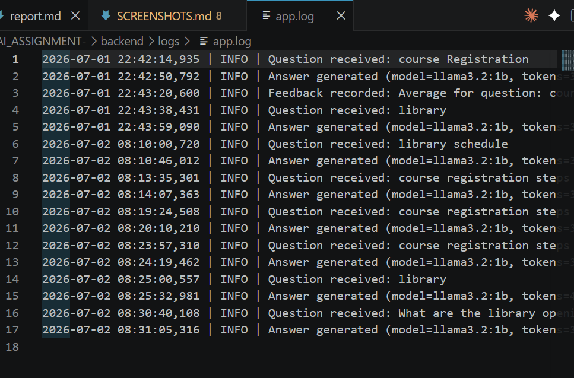

Extract from `backend/logs/app.log` showing structured log entries across two sessions (2026-07-01 and 2026-07-02). Each entry includes:
- **Timestamp** — millisecond precision (e.g. `2026-07-01 22:42:14,935`)
- **Level** — `INFO` for normal operations
- **Event** — `Question received`, `Answer generated` (with model name and token count), or `Feedback recorded`

This confirms the logging pipeline records every interaction as required.

---
